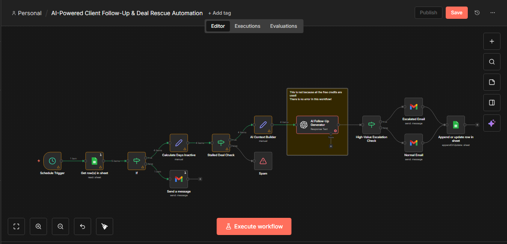

# AI-Powered Client Follow-Up & Deal Rescue Automation

This project is a **single, business-grade n8n workflow** designed to help founders, agencies, and freelancers **recover stalled deals automatically**.

It detects inactive deals from a CRM, generates **AI-written personalized follow-up emails**, escalates high-value opportunities, and updates deal status — all without manual intervention.

This is not a demo workflow.  
It is built as a **sellable, real-world automation**.

---

## 🖼️ Workflow Overview

Below is a visual overview of the complete n8n workflow:

This shows the full automation pipeline — from CRM reading to AI follow-up generation and deal updates.

---

## 🚀 Problem This Solves

Many businesses lose revenue because:
- Leads go silent
- Follow-ups are forgotten
- High-value deals are not prioritized
- CRM data becomes outdated

Manual follow-ups are:
- Time-consuming
- Inconsistent
- Easy to miss

This workflow fixes that.

---

## 🧠 What This Automation Does

On a daily schedule, the workflow:

1. Reads all deals from a Google Sheets CRM
2. Filters out closed (Lost/Won) deals
3. Calculates inactivity using date logic
4. Detects stalled deals (e.g. 3+ days inactive)
5. Builds structured context for AI
6. Uses OpenAI to generate a professional follow-up email
7. Escalates high-value deals automatically
8. Sends emails via Gmail
9. Updates the CRM to prevent duplicate follow-ups

All inside **one clean n8n workflow**.

---

## 🧩 Tools Used

- **n8n**
- **Google Sheets** (CRM)
- **OpenAI API**
- **Gmail**
- **Expressions & Conditional Logic**

---

## 📊 CRM Structure (Google Sheets)

| Column | Purpose |
|------|--------|
| deal_id | Unique deal identifier |
| name | Client name |
| email | Client email |
| company | Business name |
| deal_value | Used for escalation logic |
| last_contact_date | Used for inactivity detection |
| status | Active / Won / Lost |
| followup_sent | Prevents duplicate emails |
| priority | High / Medium / Low |
| notes | Context for AI follow-ups |

---

## 🧠 Business Logic Highlights

- Date-based inactivity detection
- Conditional branching to avoid spam
- AI-powered email personalization
- Revenue-based deal escalation
- CRM state updates

This mirrors **real operational workflows** used by businesses.

---

## 💼 Why This Is Sellable

This automation:
- Saves time for founders
- Prevents lost revenue
- Creates a professional follow-up system
- Scales without hiring

Typical use cases:
- Agencies
- Freelancers
- SaaS founders
- Consultants

---

## 📦 How This Can Be Offered as a Service

- One-time setup fee
- Monthly automation maintenance
- Custom follow-up rules per business

This workflow is intentionally designed to be **customizable per client**.

---

## 🧪 How to Test

1. Add sample deals to the CRM sheet
2. Modify `last_contact_date` values
3. Run the workflow manually
4. Observe automated follow-ups and CRM updates
